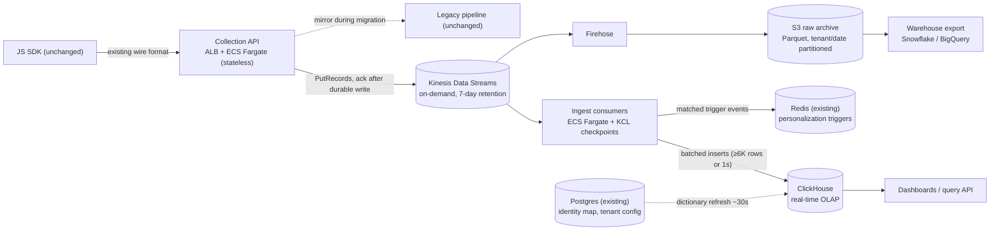

# Real-Time Analytics Pipeline — Engineer-004 Submission

**Candidate:** Tyler Bray · tylerhbray@gmail.com
**Artifact:** this repo — runnable load benchmark under `benchmark/` plus standalone SVG/Mermaid diagrams under `diagrams/` (see README for one-command benchmark run)

## Assumptions (stated up front)

- [Assumed] Average event payload ≈ 1 KB JSON → 50M events/day ≈ 50 GB/day raw.
- [Estimated] 50M events/day ≈ 580 events/sec average; "10x spike" sized as 5,800 events/sec sustained (arithmetic from the brief's numbers).
- [Assumed] The existing SDK already batches and retries on non-2xx responses (standard for analytics SDKs); if not, retry logic is added server-side at the edge, not in the SDK.
- [Assumed] "Real-time <5s" means event-created → visible-in-dashboard-query, p95.

## 1. Architecture & Technology Choices

Standalone render-safe version: `diagrams/architecture.svg` (Mermaid source: `diagrams/architecture.mmd`).

**Data flow:** SDK → Collection API (same endpoint and wire format — the SDK-compatibility constraint is satisfied at the edge, not in the client) → Kinesis (durable buffer; the collector only ACKs the SDK after a successful durable write) → two parallel consumers: (a) batching ingest into ClickHouse for dashboards/segmentation, (b) Firehose → S3 as the immutable raw archive that feeds warehouse exports, backfills, and replay.

**Technology choices and the alternatives they beat:**

- **Kinesis Data Streams over MSK/Kafka.** Same durable-buffer role, but no brokers to run. The team is 2 dedicated seniors; Kafka's power (stream joins, exactly-once transactions) isn't needed for aggregation + trigger workloads, and its ops cost is real. Capacity honesty: [Benchmarked — AWS docs] on-demand streams *start* at 4 MB/s / 4,000 records/sec write capacity and scale toward the regional cap, but AWS only commits to smoothly absorbing up to ~2x the prior peak within a 15-minute window — a true 10x step-change can throttle mid-ramp. Our absolute load is small ([Estimated] 10x spike ≈ 5,800 records/sec ≈ 6 MB/s), so the plan treats spikes as a warm-up problem, not a capacity problem: switch to provisioned capacity ahead of announced events, and lean on collector-side retry + SQS overflow for unannounced step-changes (§7).
- **ClickHouse over Redshift / Druid / Timestream / staying on Postgres.** Postgres is the current bottleneck (row store, no columnar scans). Redshift is warehouse-latency, not sub-second dashboard latency at high ingest. Druid fits but is the heaviest ops burden of the set. ClickHouse gives sub-second aggregations over billions of rows on a handful of nodes and is the *single* new system the team must learn — deliberately the only one. Self-managed on EC2 first; ClickHouse Cloud (runs on AWS) is the pressure-relief valve if ops load exceeds the team — budget headroom covers it (see cost table).
- **At-least-once delivery + idempotent inserts over exactly-once machinery.** Every event carries a client-generated `event_id`, deduplicated in two layers: ClickHouse insert-deduplication tokens catch retried batches at write time, and ReplacingMergeTree collapses stragglers at background merges. That collapse is **eventual** — plain SELECTs can return duplicates until parts merge — so queries where exactness matters (reconciliation, billing-adjacent counts) read with `FINAL`/`GROUP BY event_id` and pay the query cost, while live dashboards tolerate transient overcounts. Net: today's ~3% silent loss ([Observed] per brief) becomes rare, bounded, self-healing duplication — the correct direction for analytics.
- **Redis (already in stack) for behavioral triggers.** Ingest consumers evaluate tenant trigger rules inline (e.g., "3rd pricing view") and publish matches to Redis for the personalization runtime — trigger latency is buffer lag + evaluation, comfortably inside 5s, without a stream-processing framework.

**Event schema & identity stitching.** Events: `(tenant_id, event_id, anonymous_id, user_id?, event_type, url, ts, props JSON)`. ClickHouse table ordered by `(tenant_id, event_type, ts)` — every dashboard query is tenant-scoped, so tenant-first ordering makes 500-tenant multi-tenancy a pruning win, plus per-tenant row policies for isolation. Unknown custom-event fields land in a `props` JSON string column — schema drift can't reject events. Identity: SDK's `anonymous_id` cookie is the spine; `identify` calls write `anonymous_id → user_id` mappings to Postgres, exposed to ClickHouse as an in-memory dictionary refreshed ~every 30s [Assumed refresh interval]. Stitching resolves at query time (replay-safe, no reprocessing when mappings arrive late); a nightly job materializes canonical IDs into cold partitions.

**Cost (all [Estimated] from AWS public on-demand pricing, us-east-1):** Kinesis ≈ $400/mo (1.5 TB/mo ingested), ClickHouse 3× m6i.2xlarge + 2 TB gp3 + replicas ≈ $3,000/mo, Fargate (collectors + consumers) ≈ $700/mo, Firehose + S3 + egress ≈ $400/mo. **Total ≈ $4.5–8K/mo — 6–10x headroom under the $50K ceiling**, which is deliberate: headroom is the migration-safety and Black-Friday budget, not savings to spend. Storage: [Benchmarked] ClickHouse typically compresses this event shape ~10x (ClickHouse documented benchmarks), so 90-day hot retention ≈ 450 GB compressed.

## 2. Scale, Reliability & Migration

Standalone migration/rollback diagram: `diagrams/migration.svg` (Mermaid source: `diagrams/migration.mmd`).

**10x spikes with zero data loss.** Loss today happens because ingest is coupled to processing. The fix is a durable buffer with independent scaling on each side: (1) collectors are stateless — ALB + Fargate autoscaling on CPU/queue depth; (2) the collector ACKs only after Kinesis accepts the write, with retry/backoff and an SQS overflow path if Kinesis throttles; (3) consumers can lag without losing anything — 7-day stream retention ([Assumed] config choice; Kinesis supports up to 365 days) means a full day of consumer outage is recoverable by catch-up, not backfill. Known events (Black Friday): switch the stream to provisioned capacity ahead of time — [Benchmarked — AWS docs] on-demand scaling only commits to ~2x the prior peak per 15-minute window, and that ramp gap is the realistic loss-risk window (see "What breaks it").

**Migration without breaking anything.** The constraint is "don't touch the SDK," so the cutover point is DNS/ALB weighting in front of the collection endpoint. All step sizes, percentages, and hold times below are [Assumed] plan parameters — deliberate starting points to be tightened or relaxed against observed reconciliation variance, not measured facts:

1. **Mirror (weeks 1–6):** New collection API accepts the existing wire format and *forwards every payload to the legacy pipeline unchanged* while also writing to Kinesis. Legacy dashboards stay correct no matter what the new path does.
2. **Shift:** Route 1% → 10% → 50% → 100% of SDK traffic to the new collector. Each step holds ≥48h behind a reconciliation gate (below). **Rollback = flip the weights back** — instant, and lossless because legacy forwarding never stopped.
3. **Cutover & backfill (months 3–6):** Dashboards read from ClickHouse (MVP at month 3); historical data backfills from Postgres → S3 → ClickHouse; legacy forwarding is retired last, after 30 clean days.

**Data accuracy validation.** Three layers: (1) hourly reconciliation job comparing per-tenant, per-event-type counts between legacy and new paths — alert at >0.5% divergence [Assumed threshold, tightened as observed variance is learned]; (2) synthetic canary events with known IDs injected every minute, alarmed on end-to-end latency and presence; (3) Kinesis iterator-age alarm at 60s [Assumed] as the leading indicator that the <5s SLA is at risk.

## 3. Trade-offs & Risks

**Optimizing for:** operability by 2 engineers, zero-loss durability, and dashboard latency. **Sacrificing:** stream-processing expressiveness (no Flink — complex multi-event joins would need a new component later), exactly-once elegance (accepting dedupe-at-read), and some query latency on stitched-identity queries (query-time joins over materialized stitching).

**Biggest risks:** (1) ClickHouse operational surprises — the one system the team hasn't run; mitigated by the benchmark below, by keeping it the *only* new system, and by ClickHouse Cloud as a funded escape hatch. (2) Migration reconciliation revealing legacy undercounting — politically awkward (customers' historical numbers change); handle with per-tenant comms, not silent correction. (3) Per-tenant query abuse at 500 tenants — quotas and workload isolation from day one.

**With more time/budget:** streaming identity stitching (correct historical attribution, not just go-forward), tiered storage (S3-backed ClickHouse for infinite retention), and a schema registry for custom events instead of a JSON column.

## 4. Operating Artifact: Load Benchmark (this repo)

The design's one claim not answerable from vendor docs: **does ClickHouse make events queryable in well under 5s while sustaining 10x-peak writes, using an insert pattern a small team can operate?** `benchmark/` tests exactly that — 500 zipf-distributed tenants, ~5,800 events/sec for 60s, batched inserts (flush at ≥6,000 rows or 1s age, capping insert frequency ≈1/sec to stay clear of ClickHouse part-merge pressure), then measures per-event `insert_ts − emit_ts` and the brief's two query shapes. Stdlib-only Python + single ClickHouse binary; one command to reproduce.

**Results — all [Observed], single run on an Apple M1 MacBook (16 GB), local NVMe, ClickHouse v25.8.25.37-lts (version-pinned and checksum-verified by the runner), committed at `benchmark/results/results.md`:**

| Metric | Value |
|---|---|
| Events ingested | 348,000 (60s run) |
| Sustained ingest rate | 5,805 events/sec — 10.0x the brief's average traffic |
| Ingest lag (event created → queryable), p50 | 536 ms |
| Ingest lag p95 | 997 ms |
| Ingest lag p99 | 1,043 ms |
| Dashboard query (per-tenant 15-min live breakdown), median | 4 ms |
| Segmentation query ("viewed /pricing 3+ times"), median | 6 ms |

The p95 lag is dominated by the deliberate 1-second buffering stage — the SLA spend is the flush policy working as designed, leaving ~4s of the 5s budget for network, collection, and Kinesis hops in production.

Scope honesty: a laptop single node validates the *engine and insert pattern*, not production capacity — production adds replication, EBS (slower than local NVMe), and concurrent query load. That's why production numbers above stay labeled Estimated, and this table is the Observed floor for the mechanism.

## 5. Evidence Log

| Claim | Proof | Tier |
|---|---|---|
| ClickHouse sustains 10x-peak ingest with sub-second queryable lag (laptop floor) | Runnable benchmark in this repo + committed results | 2–3 (demo artifact + logs; rerunnable) |
| Kinesis absorbs a 10x spike *after ramp-up*; unannounced step-changes risk transient throttling | AWS on-demand capacity + ramp rules (docs) vs. computed load; mitigations in §7 | Benchmarked (doc-sourced) |
| Cost fits budget with 6–10x headroom | Itemized estimate from AWS public pricing | Estimated (Tier 0 until quoted) |
| Migration is lossless and reversible | Design argument (mirror-then-shift); not yet executed | 0 — validated by the reconciliation gates it defines |
| ~10x compression / 90-day hot retention ≈ 450 GB | ClickHouse published benchmarks | Benchmarked |

## 6. AI Usage Disclosure

**Tools:** Claude Code. **AI helped with:** analyzing the brief, laying out candidate architectures with trade-offs, drafting the benchmark code, and drafting/editing this document. **I decided:** which of the three candidate stacks Claude laid out to commit to (Kinesis + ClickHouse over MSK/Flink and over Firehose/Snowflake), and the artifact scope — benchmark the one claim vendor docs can't answer, cite AWS docs for the rest instead of fake-simulating a queue locally, and report laptop numbers as a floor rather than a capacity plan. **Checked/changed:** the benchmark ran on my machine with results committed as-is; a second adversarial review pass over the draft specifically hunted for AI overclaims and caught one — an earlier version overstated Kinesis on-demand capacity by ignoring the 4 MB/s starting throughput and the ~2x-per-15-minute ramp rule; the corrected claim is in §1 and §7. **Known weak spots:** vendor-limit and pricing figures are doc-sourced estimates, not independently quoted or experience-sourced; I don't have production streaming-ops scars behind this design — which is exactly why the riskiest claim is benchmarked instead of asserted, and why the design holds novel systems to one.

## 7. What Breaks It

- **Instant spike faster than on-demand scaling** (flash sale, not a gradual Black Friday ramp) — [Benchmarked — AWS docs] on-demand only commits to absorbing ~2x the prior peak within 15 minutes. *Detect:* PutRecords throttle metrics. *Respond:* SQS overflow buffer at the collector; pre-provision capacity for announced events.
- **Too-many-parts merge pressure** if the batching discipline erodes (many writers, small inserts). *Detect:* `system.parts` count alarm. *Respond:* all writes go through the consumer's flush policy — no ad-hoc insert paths, enforced by network policy.
- **Hot-tenant skew** — one tenant's launch shouldn't starve the rest. *Detect:* per-tenant ingest metrics. *Respond:* shard/partition keys include hashed visitor ID, per-tenant query quotas.
- **Custom-event schema drift** (SDK sends anything). Malformed events are quarantined to S3 with a dead-letter alarm — never dropped, never pipeline-blocking.
- **Consumer lag during ClickHouse maintenance.** 7-day retention makes this an SLA event, not a loss event; iterator-age alarm is the pager trigger.
- **GDPR deletion at scale** — ClickHouse deletes are expensive mutations. Batched nightly `ALTER DELETE` per tenant + S3 lifecycle rules, tracked against the 30-day statutory window, not done synchronously.
- **The benchmark itself misleads** if read as capacity planning: no replication, no concurrent query load, local NVMe. It bounds the mechanism, not the cluster size.

## 8. What Stays Human

- **Traffic-shift go/no-go at each migration step.** The reconciliation job produces numbers; a human owns the call, because "0.6% divergence" can be a bug or a legacy undercount, and those have opposite correct responses.
- **GDPR/CCPA deletion approval and legal interpretation.** Automation executes deletions; it must not decide what qualifies as personal data or whose request is valid.
- **Customer-visible schema and metric-definition changes** — silently changing what "a session" means breaks customer trust worse than latency ever did.
- **Incident severity and customer comms** during migration, especially if reconciliation reveals historical undercounting.
- **Spending against the budget headroom** (e.g., switching to ClickHouse Cloud) — that's a runway decision, not an autoscaling decision.
