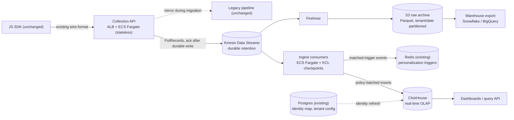

# Real-Time Analytics Pipeline — Engineer-004 Submission

**Candidate:** Tyler Bray · tylerhbray@gmail.com
**Artifact:** this repo — runnable load benchmark under `benchmark/` plus standalone SVG/Mermaid diagrams under `diagrams/` (see README for one-command benchmark run)

## Assumptions (stated up front)

- [Assumed] Average event payload ≈ 1 KB JSON → 50M events/day ≈ 50 GB/day raw.
- [Estimated] 50M events/day ≈ 580 events/sec average; "10x spike" sized as 5,800 events/sec sustained (arithmetic from the brief's numbers).
- [Assumed] The existing SDK already batches and retries on non-2xx responses (standard for analytics SDKs); if not, retry logic is added server-side at the edge, not in the SDK.
- [Assumed] "Real-time <5s" means event-created → visible-in-dashboard-query, p95.

## 1. Architecture & Technology Choices

Standalone render-safe version: `diagrams/architecture.svg` (Mermaid source: `diagrams/architecture.mmd`).

**Data flow:** SDK → Collection API (same endpoint and wire format) → durable buffer (Kinesis primary; SQS overflow during Kinesis throttles; ACK only after one durable write succeeds) → consumers: (a) batched ClickHouse ingest for dashboards/segmentation, (b) Firehose → S3 raw archive for warehouse exports, backfills, and replay.

**Technology choices and the alternatives they beat:**

- **Kinesis Data Streams over MSK/Kafka.** Same buffer role, less ops for [Observed — brief] 2 dedicated seniors. Kafka's joins/transactions are unnecessary for aggregation + trigger workloads. Capacity honesty: [Benchmarked — AWS docs] on-demand starts at 4 MB/s / 4,000 records/sec and smoothly absorbs ~2x prior peak within 15 minutes; a true 10x step-change can throttle. Our [Estimated] 10x load is only ≈5,800 records/sec / ≈6 MB/s, so the plan treats spikes as warm-up: pre-provision for announced events, retry + SQS overflow for surprises.
- **ClickHouse over Redshift / Druid / Timestream / Postgres.** Redshift is warehouse-latency; Druid adds more ops; Postgres is the current bottleneck. ClickHouse is the one new data system. Start with ClickHouse Cloud on AWS if procurement allows; self-managed EC2 is the fallback if data-residency or vendor constraints force it.
- **At-least-once + idempotency over exactly-once machinery.** Every event has `event_id`. Insert-dedup tokens catch retried batches; ReplacingMergeTree collapses stragglers during background merges. Because that collapse is eventual, exact queries use `FINAL`/`GROUP BY event_id`; live dashboards tolerate transient overcounts. Net: today's ~3% silent loss ([Observed] per brief) becomes rare, bounded duplication.
- **Redis for behavioral triggers.** Consumers evaluate tenant trigger rules inline and publish matches to Redis. Trigger latency is buffer lag + evaluation, inside 5s [Assumed SLA interpretation], without adding a stream-processing framework.

**Event schema & identity stitching.** Events: `(tenant_id, event_id, anonymous_id, user_id?, event_type, url, ts, props JSON)`. ClickHouse order key: `(tenant_id, event_type, ts)`, matching tenant-scoped dashboard queries across [Observed — brief] 500+ customers; row policies isolate tenants. Unknown custom fields go into `props`, so schema drift cannot reject events. Identity uses the SDK `anonymous_id` cookie; `identify` writes `anonymous_id → user_id` mappings to Postgres, exposed to ClickHouse as a dictionary refreshed ~every 30s [Assumed]. Query-time stitching is replay-safe; nightly materialization handles cold partitions.

**Cost ([Estimated], AWS us-east-1 public pricing):** Kinesis ≈ $400/mo, ClickHouse Cloud or equivalent EC2/gp3 ≈ $3–6K/mo, Fargate ≈ $700/mo, Firehose + S3 ≈ $400/mo. **Total ≈ $5–9K/mo — 5–10x headroom under the $50K ceiling.** Storage: [Benchmarked] ClickHouse compression around 10x gives ≈450 GB hot retention for [Assumed] 90 days.

## 2. Scale, Reliability & Migration

Standalone migration/rollback diagram: `diagrams/migration.svg` (Mermaid source: `diagrams/migration.mmd`).

**10x spikes with zero data loss.** Loss today happens because ingest is coupled to processing. Decouple it: stateless collectors scale on CPU/queue depth; ACK only after Kinesis or SQS overflow accepts the event; consumers can lag without loss because 7-day retention ([Assumed]; Kinesis supports up to 365 days [Benchmarked — AWS docs]) allows catch-up. For known events, pre-provision Kinesis; [Benchmarked — AWS docs] on-demand only guarantees ~2x prior peak per 15-minute window.

**Migration without breaking anything.** The constraint is "don't touch the SDK," so the cutover point is DNS/ALB weighting in front of the collection endpoint. All step sizes, percentages, and hold times below are [Assumed] plan parameters — deliberate starting points to be tightened or relaxed against observed reconciliation variance, not measured facts:

1. **Mirror (weeks 1–6):** New collection API accepts the existing wire format and *forwards every payload to the legacy pipeline unchanged* while also writing to Kinesis. Legacy dashboards stay correct no matter what the new path does.
2. **Shift:** Route 1% → 10% → 50% → 100% of SDK traffic to the new collector. Each step holds ≥48h behind a reconciliation gate (below). **Rollback = flip the weights back** — instant, and lossless because legacy forwarding never stopped.
3. **Cutover & backfill (months 3–6):** Dashboards read from ClickHouse (MVP at month 3); historical data backfills from Postgres → S3 → ClickHouse; legacy forwarding is retired last, after 30 clean days.

**Data accuracy validation.** Three layers: hourly reconciliation [Assumed] of per-tenant/event counts, alerting at >0.5% divergence [Assumed]; synthetic canary events every minute [Assumed]; and a 60s iterator-age alarm [Assumed] as the leading indicator that the <5s SLA is at risk.

## 3. Trade-offs & Risks

**Optimizing for:** operability by [Observed — brief] 2 dedicated engineers, zero-loss durability, and dashboard latency. **Sacrificing:** stream-processing expressiveness (no Flink), exactly-once elegance (dedupe-at-read), and some latency on stitched-identity queries.

**Biggest risks:** (1) ClickHouse operational surprises; mitigated by benchmarking, using Cloud where possible, and keeping it the only novel data system. (2) Reconciliation revealing legacy undercounting; handle with per-tenant comms, not silent correction. (3) Query abuse across [Observed — brief] 500+ customers; enforce quotas and workload isolation from day one.

**With more time/budget:** streaming identity stitching (correct historical attribution, not just go-forward), tiered storage (S3-backed ClickHouse for infinite retention), and a schema registry for custom events instead of a JSON column.

## 4. Operating Artifact: Load Benchmark (this repo)

The design's riskiest claim is not vendor-doc capacity; it is whether ClickHouse makes events queryable in well under 5s while sustaining the 10x write pattern. `benchmark/` tests that: 500 [Observed artifact] zipf-distributed tenants, ~5,800 events/sec for 60s [Observed artifact], policy-batched inserts (≥6,000 rows or 1s age [Assumed]), then per-event `insert_ts − emit_ts` plus the brief's dashboard and segmentation query shapes.

**Results — all [Observed], single run on an Apple M1 MacBook (16 GB), local NVMe, ClickHouse v25.8.25.37-lts (version-pinned; release asset SHA-256 verified by the runner), committed at `benchmark/results/results.md`:**

| Metric | Value |
|---|---|
| Events ingested | 348,000 (60s run) |
| Sustained ingest rate | 5,804 events/sec — 10.0x the brief's average traffic |
| Ingest lag (event created → queryable), p50 | 553 ms |
| Ingest lag p95 | 1,033 ms |
| Ingest lag p99 | 1,058 ms |
| Dashboard query (per-tenant 15-min live breakdown), median | 4 ms |
| Segmentation query ("viewed /pricing 3+ times"), median | 5 ms |

The p95 lag is dominated by the deliberate 1-second buffering stage — the SLA spend is the flush policy working as designed, leaving ~4s of the 5s budget for network, collection, and Kinesis hops in production.

Scope honesty: a laptop single node validates the *engine and insert pattern*, not production capacity. Production adds replication, slower storage, and concurrent query load. The benchmark schema is deliberately narrower than production: it tests ingest/query latency, not `event_id` dedupe or identity stitching.

## 5. Evidence Log

| Claim | Proof | Tier |
|---|---|---|
| ClickHouse sustains 10x-peak ingest with sub-second queryable lag (laptop floor) | Runnable benchmark in this repo + committed results | 2–3 (demo artifact + logs; rerunnable) |
| Kinesis absorbs a 10x spike *after ramp-up*; unannounced step-changes risk transient throttling | AWS on-demand capacity + ramp rules (docs) vs. computed load; mitigations in §7 | Benchmarked (doc-sourced) |
| Cost fits budget with 5–10x headroom | Itemized estimate from AWS public pricing | Estimated (Tier 0 until quoted) |
| Migration is lossless and reversible | Design argument (mirror-then-shift); not yet executed | 0 — validated by the reconciliation gates it defines |
| ~10x compression / 90-day hot retention ≈ 450 GB | ClickHouse published benchmarks | Benchmarked |

## 6. AI Usage Disclosure

**Tools:** Claude Code and OpenAI Codex. **AI helped with:** architecture options, benchmark scaffolding, and editing. **I decided:** Kinesis + ClickHouse, the benchmark scope, and the evidence posture. **Checked/changed:** ran the benchmark locally through the pinned runner; an adversarial review caught an earlier Kinesis overclaim that ignored the 4 MB/s starting point and ~2x-per-15-minute ramp rule; the corrected claim is in §1/§7. **Known weak spot:** my hands-on background is stronger in AI automation than production streaming operations, so I benchmarked the riskiest ClickHouse claim instead of asserting it.

## 7. What Breaks It

- **Instant spike faster than on-demand scaling** (flash sale, not a gradual Black Friday ramp) — [Benchmarked — AWS docs] on-demand only commits to absorbing ~2x the prior peak within 15 minutes. *Detect:* PutRecords throttle metrics. *Respond:* SQS overflow buffer at the collector; pre-provision capacity for announced events.
- **Too-many-parts merge pressure** if the batching discipline erodes (many writers, small inserts). *Detect:* `system.parts` count alarm. *Respond:* all writes go through the consumer's flush policy — no ad-hoc insert paths, enforced by network policy.
- **Hot-tenant skew** — one tenant's launch shouldn't starve the rest. *Detect:* per-tenant ingest metrics. *Respond:* shard/partition keys include hashed visitor ID, per-tenant query quotas.
- **Custom-event schema drift** (SDK sends anything). Malformed events are quarantined to S3 with a dead-letter alarm — never dropped, never pipeline-blocking.
- **Consumer lag during ClickHouse maintenance.** 7-day retention [Assumed config] makes this an SLA event, not a loss event; iterator-age alarm is the pager trigger.
- **GDPR deletion at scale** — ClickHouse deletes and archived Parquet rewrites are expensive. Keep a deletion-tombstone table as source of truth; apply batched ClickHouse deletes for hot data, rewrite affected S3 tenant/date partitions asynchronously, and make exports filter tombstones until compaction completes.
- **The benchmark itself misleads** if read as capacity planning: no replication, no concurrent query load, local NVMe. It bounds the mechanism, not the cluster size.

## 8. What Stays Human

- **Traffic-shift go/no-go at each migration step.** The reconciliation job produces numbers; a human owns the call, because a small divergence can be a bug or a legacy undercount, and those have opposite correct responses.
- **GDPR/CCPA deletion approval and legal interpretation.** Automation executes deletions; it must not decide what qualifies as personal data or whose request is valid.
- **Customer-visible schema and metric-definition changes** — silently changing what "a session" means breaks customer trust worse than latency ever did.
- **Incident severity and customer comms** during migration, especially if reconciliation reveals historical undercounting.
- **Spending against the budget headroom** (e.g., switching to ClickHouse Cloud) — that's a runway decision, not an autoscaling decision.
